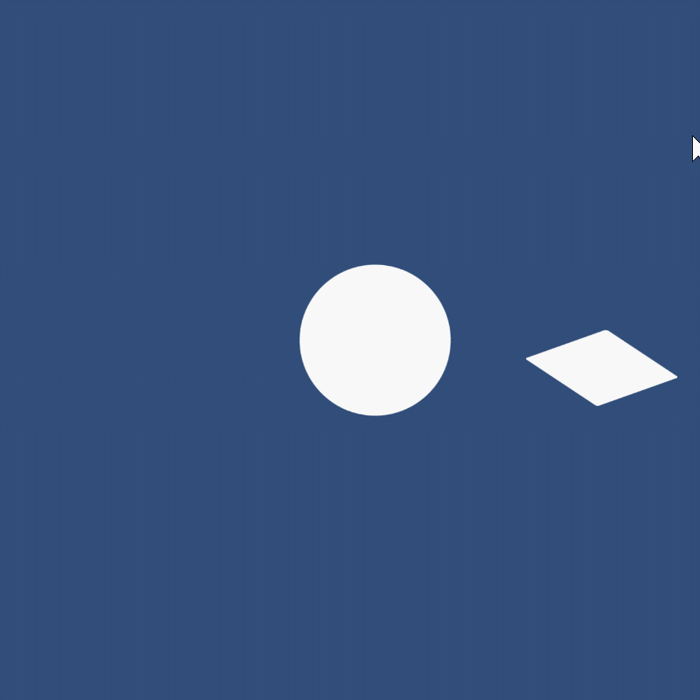
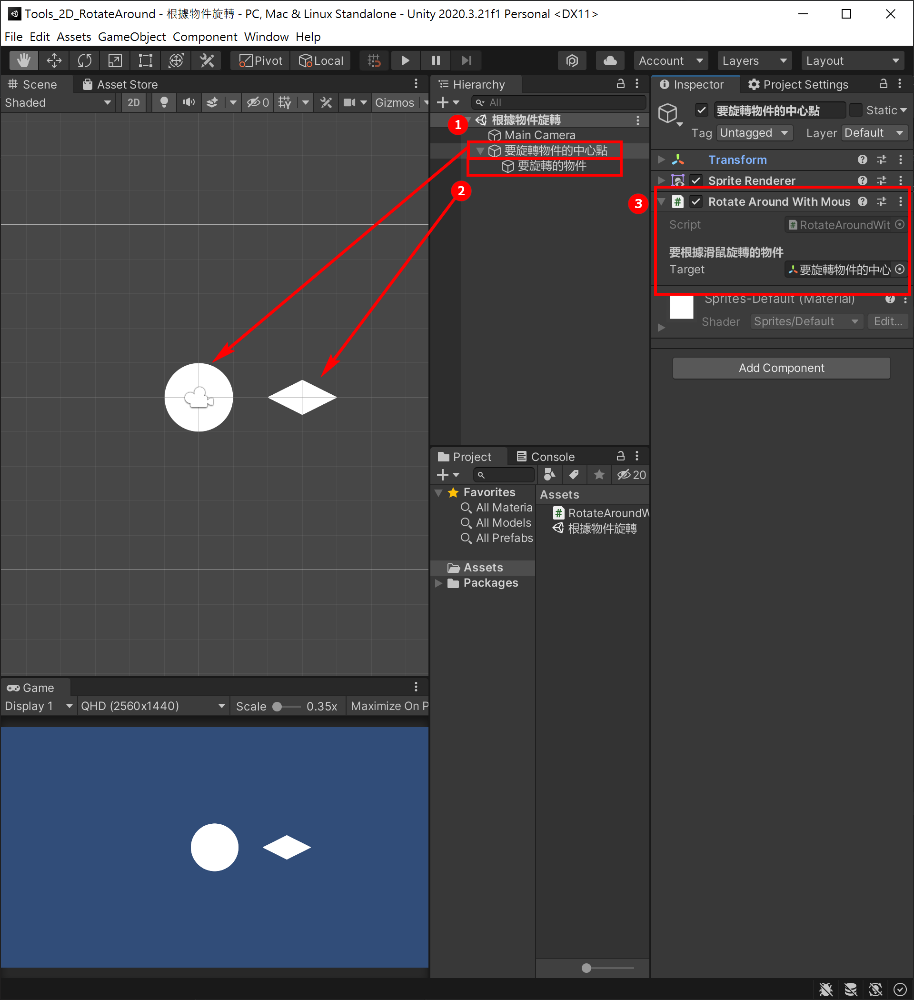
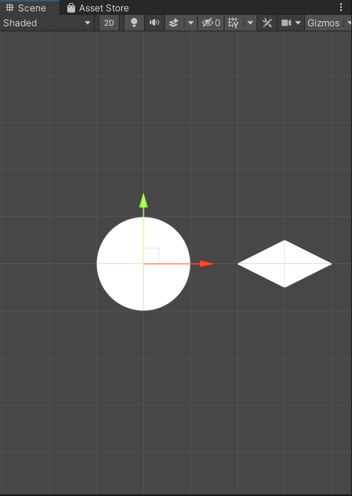
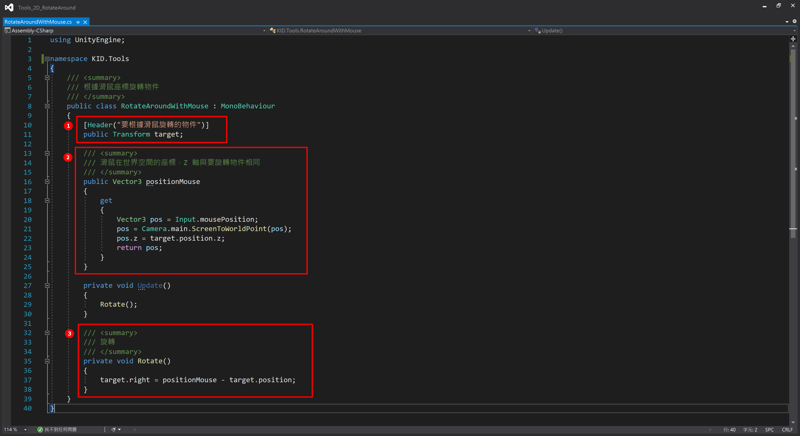

# Unity_Tools_2D_RotateAroundWithMouse
 Unity 工具 2D 根據滑鼠旋轉物件

# 使用教學

## 完成效果

[展示網頁版](https://kid421.github.io/Unity_Tools_2D_RotateAround/Demo)

## 設定教學

1. 此物件為圖中的圓圈
2. 此物件為圖中的鑽石形狀，要旋轉的圖，請放在圓圈內當子物件，並且設定在圓圈物件的 X 方向，如下圖
3. [程式](./Tools_2D_RotateAround/Assets/RotateAroundWithMouse.cs)
 將連結內的 C# 放在 1. 圓圈物件上，欄位請設定為圓圈物件

ps. 圓圈為中心點，鑽石會以圓圈為中心點根據滑鼠旋轉，可將圓圈圖片刪除

## 原理說明

1. 定義要控制的欄位，使用變形資料類型為了方便存取座標
2. 定義唯讀屬性，使用 API 將滑鼠座標轉為世界座標，並固定 Z 軸
3. 讓目標物件的 X 軸 (right) 與滑鼠跟目標物件向量相同，即為面向滑鼠
